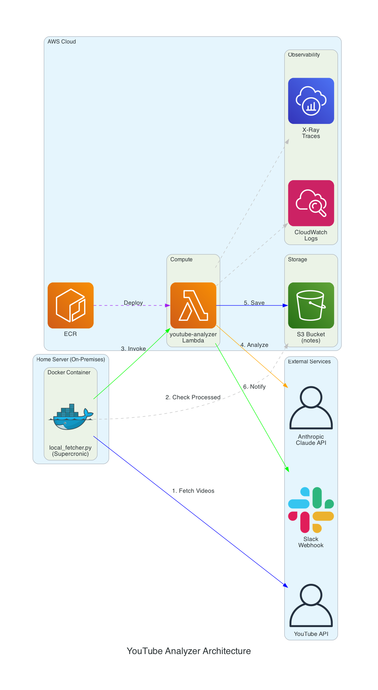

# YouTube Analyzer Agent

An AI agent that analyzes YouTube videos by fetching transcripts, generating summaries, saving notes, and sending Slack notifications.

Built with:
- **Claude Agent SDK** - Agent logic and LLM interactions
- **AWS Bedrock AgentCore** - Deployment, runtime, and observability
- **AWS Lambda** - Serverless deployment option

## Features

- 🎬 Fetch YouTube video transcripts automatically
- 📝 Generate structured summaries with key points, quotes, and action items
- 💾 Save notes locally or to S3
- 📢 Send Slack notifications when summaries are ready
- 📊 Full observability via CloudWatch GenAI dashboard
- 🐳 Docker support for local development and Lambda deployment

## Architecture



### Hybrid Fetcher Architecture

YouTube blocks transcript requests from cloud IPs (AWS, GCP, etc.). This project uses a hybrid architecture to work around this limitation:

1. **Local Fetcher (Home Server)**: A Docker container running on a home server with a residential IP address. It runs on a cron schedule (every 30 minutes via Supercronic) to:
   - Fetch the latest videos from monitored YouTube channels
   - Check S3 for already-processed videos to avoid duplicates
   - Fetch transcripts using the residential IP (bypasses YouTube's cloud IP blocking)
   - Invoke the Lambda function with the pre-fetched transcript

2. **AWS Lambda**: Receives the pre-fetched transcript and runs the AI analysis pipeline:
   - Calls Claude API for summarization
   - Saves notes to S3
   - Sends Slack notifications
   - Exports traces to X-Ray/CloudWatch for observability

This architecture separates the "fetching" concern (which requires residential IP) from the "processing" concern (which can run anywhere), allowing the AI processing to scale in the cloud while still accessing YouTube transcripts reliably.

## Project Structure

```
youtube-analyzer/
├── agent.py              # Main agent logic
├── lambda_handler.py     # AWS Lambda handler
├── server.py             # FastAPI HTTP server
├── tools/
│   ├── __init__.py
│   ├── youtube.py        # YouTube transcript fetching
│   ├── notes.py          # Note creation and storage
│   └── slack.py          # Slack notifications
├── Dockerfile            # Lambda-compatible Docker image
├── Dockerfile.local      # Local development Docker image
├── docker-compose.yml    # Docker Compose for local dev
├── deploy.py             # AgentCore deployment script
├── deploy_lambda.py      # Lambda deployment script
├── requirements.txt
├── .env.example          # Environment variables template
└── README.md
```

## Quick Start

### 1. Setup Environment

```bash
# Clone/create the project
cd youtube-analyzer

# Create virtual environment
python -m venv venv
source venv/bin/activate  # On Windows: venv\Scripts\activate

# Install dependencies
pip install -r requirements.txt

# Copy and configure environment variables
cp .env.example .env
# Edit .env with your API keys
```

### 2. Configure API Keys

Edit `.env` with your credentials:

```bash
# Required
ANTHROPIC_API_KEY=your-key-here

# For Slack notifications (optional but recommended)
SLACK_WEBHOOK_URL=https://hooks.slack.com/services/xxx/yyy/zzz
```

### 3. Test Locally

```bash
# Load environment variables
export $(cat .env | xargs)

# Run the agent
python agent.py "https://www.youtube.com/watch?v=VIDEO_ID"
```

---

## 🐳 Docker Usage

### Local Development with Docker

```bash
# Build and run interactively
docker-compose up local

# Analyze a single video
VIDEO_URL="https://youtube.com/watch?v=VIDEO_ID" docker-compose up analyze

# Run as HTTP server (port 8080)
docker-compose up server
```

### Test Lambda Locally

```bash
# Start Lambda emulator (port 9000)
docker-compose up lambda

# Test with curl (in another terminal)
curl -X POST "http://localhost:9000/2015-03-31/functions/function/invocations" \
  -d '{"video_url": "https://youtube.com/watch?v=VIDEO_ID"}'
```

### Build Docker Image Manually

```bash
# For local development
docker build -f Dockerfile.local -t youtube-analyzer:local .
docker run -it --env-file .env youtube-analyzer:local

# For Lambda
docker build -f Dockerfile -t youtube-analyzer:lambda .
```

---

## ☁️ Deploy to AWS Lambda

### Prerequisites

1. **Docker** installed and running
2. **AWS CLI** configured (`aws configure`)
3. **IAM permissions** for Lambda, ECR, and API Gateway

### Deploy

```bash
# Set environment variables
export ANTHROPIC_API_KEY=your-key
export SLACK_WEBHOOK_URL=your-webhook  # optional

# Deploy to Lambda
python deploy_lambda.py

# Deploy with API Gateway endpoint
python deploy_lambda.py --create-api

# Custom configuration
python deploy_lambda.py \
  --function-name my-youtube-analyzer \
  --region us-west-2 \
  --memory 2048 \
  --timeout 600 \
  --create-api
```

### Test Deployed Lambda

```bash
# Via AWS CLI
aws lambda invoke \
  --function-name youtube-analyzer \
  --payload '{"video_url": "https://youtube.com/watch?v=VIDEO_ID"}' \
  --cli-binary-format raw-in-base64-out \
  response.json && cat response.json

# Via API Gateway (if created)
curl -X POST https://YOUR_API_ID.execute-api.REGION.amazonaws.com/analyze \
  -H "Content-Type: application/json" \
  -d '{"video_url": "https://youtube.com/watch?v=VIDEO_ID"}'
```

---

## 🚀 Deploy to AgentCore

### Prerequisites

1. **AWS Account** with Bedrock model access enabled for Claude
2. **AWS CLI** configured (`aws configure`)
3. **CloudWatch Transaction Search** enabled (one-time setup):
   - Go to CloudWatch Console
   - Settings > Account > X-Ray traces
   - Transaction Search > Edit > Enable

### Deploy

```bash
# Install AgentCore toolkit
pip install bedrock-agentcore-starter-toolkit

# Deploy
python deploy.py
```

### Invoke Deployed Agent

```python
from bedrock_agentcore_starter_toolkit import Runtime

runtime = Runtime()
response = runtime.invoke(
    prompt="Analyze this video: https://youtube.com/watch?v=VIDEO_ID"
)
print(response)
```

---

## 🌐 HTTP Server Mode

Run as a standalone HTTP server with FastAPI:

```bash
# Direct
python server.py

# With Docker
docker-compose up server

# With uvicorn (production)
uvicorn server:app --host 0.0.0.0 --port 8080 --workers 4
```

### API Endpoints

| Method | Endpoint | Description |
|--------|----------|-------------|
| GET | `/` | API info |
| GET | `/health` | Health check |
| POST | `/analyze` | Analyze a video |
| GET | `/status/{task_id}` | Check async task status |

### Example Request

```bash
curl -X POST http://localhost:8080/analyze \
  -H "Content-Type: application/json" \
  -d '{"video_url": "https://youtube.com/watch?v=VIDEO_ID"}'
```

---

## Observability

Once deployed to AgentCore, view metrics in CloudWatch:

1. Open **CloudWatch Console**
2. Go to **GenAI Observability**
3. Select **Bedrock AgentCore** tab

You'll see:
- **Agents View** - All deployed agents with metrics
- **Sessions View** - Individual conversation sessions
- **Traces View** - Detailed execution traces with spans

### Key Metrics

- Session count and duration
- Token usage (input/output)
- Latency per operation
- Error rates
- Tool call frequency

---

## Configuration Options

### Notes Backend

```bash
# Local filesystem (default)
NOTES_BACKEND=local
NOTES_LOCAL_DIR=./notes

# AWS S3
NOTES_BACKEND=s3
NOTES_S3_BUCKET=your-bucket-name
```

### Slack Integration

**Option 1: Webhook (Simpler)**
1. Create a Slack App at https://api.slack.com/apps
2. Add "Incoming Webhooks" feature
3. Create a webhook for your channel
4. Set `SLACK_WEBHOOK_URL` in `.env`

**Option 2: Bot Token (More Features)**
1. Create a Slack App
2. Add "chat:write" scope under OAuth
3. Install to workspace
4. Set `SLACK_BOT_TOKEN` and `SLACK_DEFAULT_CHANNEL`

---

## Extending the Agent

### Add New Tools

1. Create tool function in `tools/`:

```python
# tools/my_tool.py
def my_tool(input: str) -> dict:
    # Your logic
    return {"success": True, "result": "..."}
```

2. Add tool definition in `agent.py`:

```python
TOOLS.append({
    "name": "my_tool",
    "description": "What this tool does",
    "input_schema": {
        "type": "object",
        "properties": {
            "input": {"type": "string", "description": "..."}
        },
        "required": ["input"]
    }
})
```

3. Add handler in `handle_tool_call()`:

```python
elif tool_name == "my_tool":
    result = my_tool(tool_input["input"])
    return json.dumps(result)
```

### Customize Prompts

Edit `SYSTEM_PROMPT` in `agent.py` to change:
- Summary format
- Workflow steps
- Output style

---

## Troubleshooting

### "No transcript available"
- Video may have disabled captions
- Try a different video
- Check if video is age-restricted or private

### Slack notifications not sending
- Verify webhook URL is correct
- Check channel permissions
- Look for errors in console output

### Docker build fails
- Ensure Docker daemon is running
- Check available disk space
- Try `docker system prune` to clean up

### Lambda deployment fails
- Verify AWS credentials: `aws sts get-caller-identity`
- Check IAM permissions for ECR, Lambda, IAM
- Ensure Docker is running

### AgentCore deployment fails
- Verify AWS credentials: `aws sts get-caller-identity`
- Check Bedrock model access is enabled
- Ensure CloudWatch Transaction Search is enabled

---

## Next Steps

After building this agent, you'll be ready for:
- **RAG systems** - Same patterns, add vector DB retrieval tool
- **Multi-agent workflows** - Coordinate multiple specialized agents
- **Production deployment** - Add error handling, retries, monitoring alerts

## License

MIT
